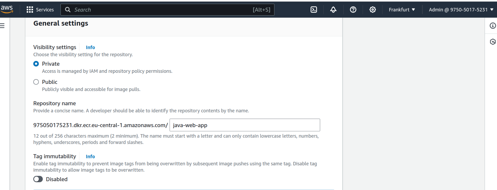
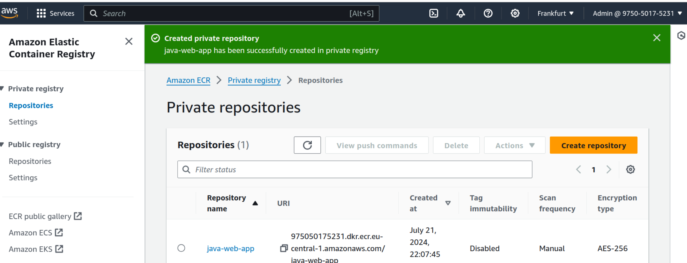
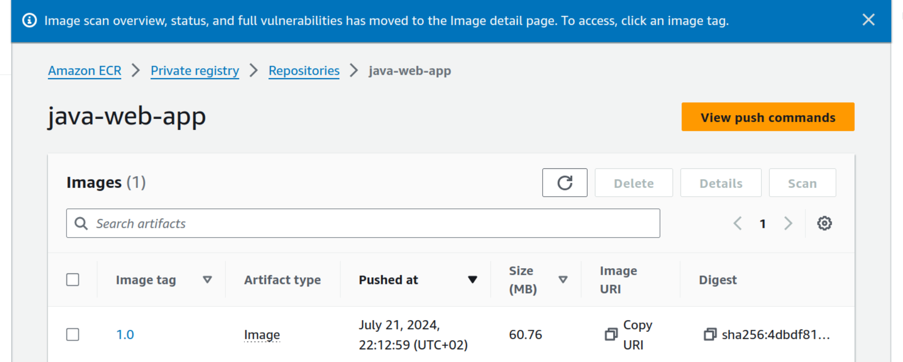
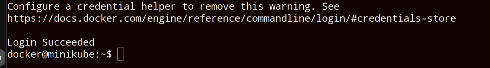
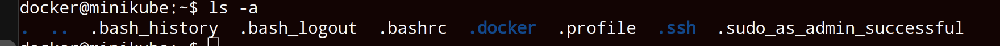

<h1>Kubernetes Demo Project4</h1>
<h2>Technologies used</h2>

- <b>Kubernetes</b> 
- <b>Helm</b>
- <b>AWS ECR</b>
- <b>Docker</b>

<h2>Detailed Description of Project </h2>
1. Create Secret for credentials for the private Docker registry 
2. Configure the Docker registry secret in application Deployment component 
3. Deploy web application image from our private Docker registry in K8s cluster 

   

   <h2>step1</h2>
   create a private docker registry in AWS (AWS Elastic Container Registry) 
      
   
   
   

   build the application into docker image and push to the registry 
   docker build -t java-web-app:1.0 .
   docker tag java-web-app:1.0 975050175231.dkr.ecr.eu-central-1.amazonaws.com/java-web-app:1.0
   docker push 975050175231.dkr.ecr.eu-central-1.amazonaws.com/java-web-app:1.0
   
   java-web-application with the tag 1.0 has successfully been push to the registry
   

   <h2>step2</h2>
   get the access token from AWS (aws ecr get-login-password)
   ssh into minikube (minikube ssh)
   login to ecr using the access token as password in minikube
   docker login --username AWS -p (paste the accesstoken after password) + url of repo
   .docker directory will be created and the access token will be saved in .docker/config.json 

   

   
  

 

<h2>step3</h2>

  
 

 <h2>step4</h2>

  
 

 <h2>step5</h2>

   
    
    
   
     

